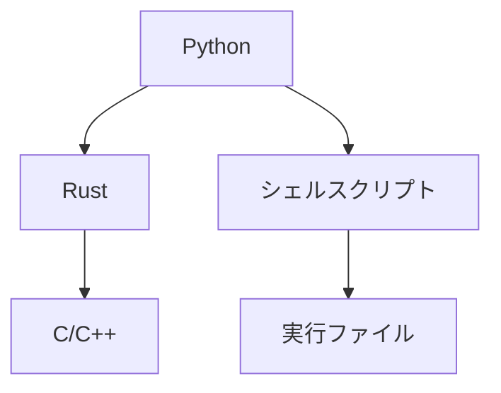

## 目次

```toc

```

## プログラミング言語



2020 年はこんな感じでやってみようと考えている。つまり、

- Python: ユーザに提供されるインターフェースとして採用。基本的にワークフローと可視化のためのグルー言語として使う。特定の高速なパッケージも使う。
- Rust: オブジェクト設計が必要なモジュールの実装のために採用。Python から呼び出す。
- C/C++: 本当に速度が必要な関数の実装のために採用。Rust から呼び出す。
- シェルスクリプト: 環境依存のコマンドや実行ファイルを隠蔽するための緩衝材として採用。Python から呼び出す。
- 実行ファイル: この形式でしか提供されていないものなど。

## 開発環境

- ローカル
  - macOS Catalina + zsh + Homebrew
  - [Alacritty](https://github.com/jwilm/alacritty) + [tmux](https://github.com/tmux/tmux)
  - [Visual Studio Code](https://code.visualstudio.com/#meet-intellisense)
- リモート
  - CentOS 7 + bash
  - Jupyter Notebook

コードや Jupyter Notebook は全てリモートに置いて Git(Hub) で管理して、編集・実行はローカルから行う。2020 年はターミナルから `ssh` -> Vim/Emacs で編集、ではなく、ローカルから直接、

- コードは Visual Studio Code で、
- Jupyter Notebook は (今のところ Mac 限定だが) [ここ]()のやり方を使ってブラウザで、

ターミナルを経由することなく、それぞれ編集する。

### Homebrew コマンド

- `$ brew doctor`: 定期的に実行して、表示される問題を解消する
- `$ brew upgrade`: Homebrew 本体とパッケージのアップデート、こちらもたまに実行する
- `$ brew install PACKAGE`, `$ brew uninstall PACKAGE`, `$ brew list`: よく使うのはこれ

### リモートシェル設定

- `$HOME/.bashrc`
- `$HOME/.local` 以下に必要な実行ファイルやライブラリをインストール
- 実行ファイルのパスを通すには `PATH`
- コンパイル時に必要なライブラリのパスを通すには (`LDFLAGS` ではなく) `LIBRARY_PATH`
- 実行時に必要なライブラリのパスを通すには `LD_LIBRARY_PATH`
- C/C++ コンパイル時に必要なインクルードファイルのパスを通すには (`CPPFLAGS` ではなく) `CPATH`
  - C だけ [C++] だけの場合は (`CFLAGS` [`CXXFLAGS`] ではなく) `C_INCLUDE_PATH` [`CPLUS_INCLUDE_PATH`]

### tmux 設定

- `$HOME/.tmux.conf`
- 設定が反映されない場合は一度 `tmux kill-server` する

```ini
# Enable mouse
set -g mouse on

# Copy with mouse to clipboard in Mac
bind-key -T copy-mode MouseDragEnd1Pane send-keys -X copy-pipe-and-cancel "pbcopy"

# Do not show a prompt before killing a pane
bind-key x kill-pane
```

- 色を使うためにシェルの設定に以下を追加

```shell
export TERM='xterm-256color'
```

### Alacritty 設定

- `$HOME/.alacritty.yml`
- Mac の option を alt キーにする

```yaml
- { key: A, mods: Alt, chars: "\x1ba" }
- { key: B, mods: Alt, chars: "\x1bb" }
- { key: C, mods: Alt, chars: "\x1bc" }
- { key: D, mods: Alt, chars: "\x1bd" }
- { key: E, mods: Alt, chars: "\x1be" }
- { key: F, mods: Alt, chars: "\x1bf" }
- { key: G, mods: Alt, chars: "\x1bg" }
- { key: H, mods: Alt, chars: "\x1bh" }
- { key: I, mods: Alt, chars: "\x1bi" }
- { key: J, mods: Alt, chars: "\x1bj" }
- { key: K, mods: Alt, chars: "\x1bk" }
- { key: L, mods: Alt, chars: "\x1bl" }
- { key: M, mods: Alt, chars: "\x1bm" }
- { key: N, mods: Alt, chars: "\x1bn" }
- { key: O, mods: Alt, chars: "\x1bo" }
- { key: P, mods: Alt, chars: "\x1bp" }
- { key: Q, mods: Alt, chars: "\x1bq" }
- { key: R, mods: Alt, chars: "\x1br" }
- { key: S, mods: Alt, chars: "\x1bs" }
- { key: T, mods: Alt, chars: "\x1bt" }
- { key: U, mods: Alt, chars: "\x1bu" }
- { key: V, mods: Alt, chars: "\x1bv" }
- { key: W, mods: Alt, chars: "\x1bw" }
- { key: X, mods: Alt, chars: "\x1bx" }
- { key: Y, mods: Alt, chars: "\x1by" }
- { key: Z, mods: Alt, chars: "\x1bz" }
- { key: A, mods: Alt|Shift, chars: "\x1bA" }
- { key: B, mods: Alt|Shift, chars: "\x1bB" }
- { key: C, mods: Alt|Shift, chars: "\x1bC" }
- { key: D, mods: Alt|Shift, chars: "\x1bD" }
- { key: E, mods: Alt|Shift, chars: "\x1bE" }
- { key: F, mods: Alt|Shift, chars: "\x1bF" }
- { key: G, mods: Alt|Shift, chars: "\x1bG" }
- { key: H, mods: Alt|Shift, chars: "\x1bH" }
- { key: I, mods: Alt|Shift, chars: "\x1bI" }
- { key: J, mods: Alt|Shift, chars: "\x1bJ" }
- { key: K, mods: Alt|Shift, chars: "\x1bK" }
- { key: L, mods: Alt|Shift, chars: "\x1bL" }
- { key: M, mods: Alt|Shift, chars: "\x1bM" }
- { key: N, mods: Alt|Shift, chars: "\x1bN" }
- { key: O, mods: Alt|Shift, chars: "\x1bO" }
- { key: P, mods: Alt|Shift, chars: "\x1bP" }
- { key: Q, mods: Alt|Shift, chars: "\x1bQ" }
- { key: R, mods: Alt|Shift, chars: "\x1bR" }
- { key: S, mods: Alt|Shift, chars: "\x1bS" }
- { key: T, mods: Alt|Shift, chars: "\x1bT" }
- { key: U, mods: Alt|Shift, chars: "\x1bU" }
- { key: V, mods: Alt|Shift, chars: "\x1bV" }
- { key: W, mods: Alt|Shift, chars: "\x1bW" }
- { key: X, mods: Alt|Shift, chars: "\x1bX" }
- { key: Y, mods: Alt|Shift, chars: "\x1bY" }
- { key: Z, mods: Alt|Shift, chars: "\x1bZ" }
- { key: Key1, mods: Alt, chars: "\x1b1" }
- { key: Key2, mods: Alt, chars: "\x1b2" }
- { key: Key3, mods: Alt, chars: "\x1b3" }
- { key: Key4, mods: Alt, chars: "\x1b4" }
- { key: Key5, mods: Alt, chars: "\x1b5" }
- { key: Key6, mods: Alt, chars: "\x1b6" }
- { key: Key7, mods: Alt, chars: "\x1b7" }
- { key: Key8, mods: Alt, chars: "\x1b8" }
- { key: Key9, mods: Alt, chars: "\x1b9" }
- { key: Key0, mods: Alt, chars: "\x1b0" }
- { key: Space, mods: Control, chars: "\x00" } # Ctrl + Space
- { key: Grave, mods: Alt, chars: "\x1b`" } # Alt + `
- { key: Grave, mods: Alt|Shift, chars: "\x1b~" } # Alt + ~
- { key: Period, mods: Alt, chars: "\x1b." } # Alt + .
- { key: Key8, mods: Alt|Shift, chars: "\x1b*" } # Alt + *
- { key: Key3, mods: Alt|Shift, chars: "\x1b#" } # Alt + #
- { key: Period, mods: Alt|Shift, chars: "\x1b>" } # Alt + >
- { key: Comma, mods: Alt|Shift, chars: "\x1b<" } # Alt + <
- { key: Minus, mods: Alt|Shift, chars: "\x1b_" } # Alt + _
- { key: Key5, mods: Alt|Shift, chars: "\x1b%" } # Alt + %
- { key: Key6, mods: Alt|Shift, chars: "\x1b^" } # Alt + ^
- { key: Backslash, mods: Alt, chars: "\x1b\\" } # Alt + \
- { key: Backslash, mods: Alt|Shift, chars: "\x1b|" } # Alt + |
```

- tmux 用のキーバインド

```yml
- { key: D, mods: Command, chars: "\x02\x64" } # detach a session
- { key: T, mods: Command, chars: "\x02\x63" } # create a window
- { key: P, mods: Command, chars: "\x02\x25" } # create a horizontal pane
- { key: P, mods: Command|Shift, chars: "\x02\x22" } # create a vertical pane
- { key: W, mods: Command, chars: "\x02\x78" } # close a pane (close a window with a single pane)
- { key: Up, mods: Command, chars: "\x02\x1b\x5b\x41" } # move to another pane
- { key: Down, mods: Command, chars: "\x02\x1b\x5b\x42" }
- { key: Right, mods: Command, chars: "\x02\x1b\x5b\x43" }
- { key: Left, mods: Command, chars: "\x02\x1b\x5b\x44" }
```

- 日本語に対応するためにシェルの設定に以下を追加

```shell
export LANG='ja_JP.UTF-8'
```

### Visual Studio Code

- `$ code ファイル名`: ターミナルから vscode のタブでファイルを開く
  - コマンドパレット -> `Shell Command: Install 'code' command in PATH` で `code`コマンドをインストールしておく

#### ショートカットキー

- `Command + Shift + P` or `Alt + X`: コマンドパレットを開く
- `Alt + Shift + F`: 自動フォーマット
- `` Ctrl + Shift + ` ``: ターミナルウィンドウを開閉
- `Ctrl + @` (ユーザ設定): ターミナルとエディタを移動
  - `Terminal: Focus Terminal` コマンド、When = `!terminalFocus`; および
  - `View: Focus Active Editor Group` コマンド、When = `terminalFocus`
- `Ctrl + M` (ユーザ設定): ターミナルウィンドウを最大化・戻す
  - `View: Toggle Maximized Panel` コマンド、When = `terminalFocus`

### Jupyter Notebook

[ここ]()に従ってローカルからすぐにリモートの Jupyter をブラウザで実行できるようにしておく。将来的に vscode のリモート Jupyter 機能がより軽く便利になればそちらに移行するかもしれない。

- `$HOME/.jupyter/custom/custom.css` でスタイルを変更できる
- Notebook を公開したい場合は、GitHub にアップロードしてから [nbviewer](https://nbviewer.jupyter.org/) のリンクを文章に埋め込む

#### ショートカットキー

- 関数・クラスの名前の上で `Shift + Tab`: init signature 表示

#### 拡張機能

- [Snippets Menu](https://jupyter-contrib-nbextensions.readthedocs.io/en/latest/nbextensions/snippets_menu/readme.html): コードのテンプレートを登録できる。下はトップレベルのテンプレートの例。
  - `display` はデータフレーム等を整形して表示できる
  - [Plotly](https://plot.ly/python/) (version 4) は interactive plot 用
    - [cufflinks](https://github.com/santosjorge/cufflinks) を使えばデータフレームに対しても `pd.DataFrame.iplot()` のように書ける
  - [logzero](https://logzero.readthedocs.io/en/latest/) は標準よりも優れたロガー。`loglevel`は状況に応じて`DEBUG`に変える

```python
%matplotlib inline
%config InlineBackend.figure_format = 'retina'
from IPython.display import display
import plotly.offline as py
py.init_notebook_mode(connected=True)
import plotly.io as pio
pio.templates.default = 'plotly_white'
import logging
import logzero
logzero.loglevel(logging.INFO)
```

### Git & GitHub & GitLab

- `$HOME/.gitconfig`

```ini
[user]
    name = ユーザ名
    email = メールアドレス
[color]
    ui = auto
[url "git@github.com:"]
    insteadof = https://github.com/
[url "git@gitlab.com:"]
    insteadof = https://gitlab.com/
```

- `$ git log` をデフォルトでツリー表示するためにシェルの設定に以下を追加

```shell
git() {
    if [[ $@ == "log" ]]; then
        git log --oneline --graph --decorate
    else
        command git "$@"
    fi
}
```

- SSH 接続の設定は`$HOME/.ssh/config`に記述

```ini
Host github.com
    User ユーザ名
    HostName ssh.github.com
    IdentityFile ~/.ssh/秘密鍵ファイル名
    ServerAliveInterval 60
```

