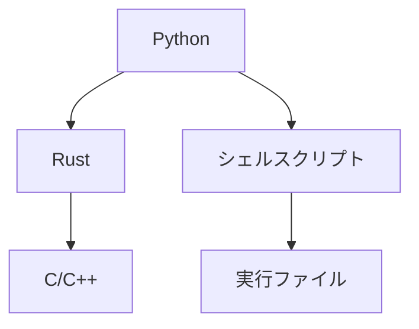

2020 年はこんな感じでやってみようと考えている。つまり、

- Python: ユーザに提供されるインターフェースとして採用。基本的にワークフローと可視化のためのグルー言語として使う。特定の高速なパッケージも使う。
- Rust: オブジェクト設計が必要なモジュールの実装のために採用。Python から呼び出す。
- C/C++: 本当に速度が必要な関数の実装のために採用。Rust から呼び出す。
- シェルスクリプト: 環境依存のコマンドや実行ファイルを隠蔽するための緩衝材として採用。Python から呼び出す。
- 実行ファイル: この形式でしか提供されていないものなど。

特にどこに力を入れたいかと言うと、Rust と C の低レベル部分 (SIMD 等) を頑張りたい。

